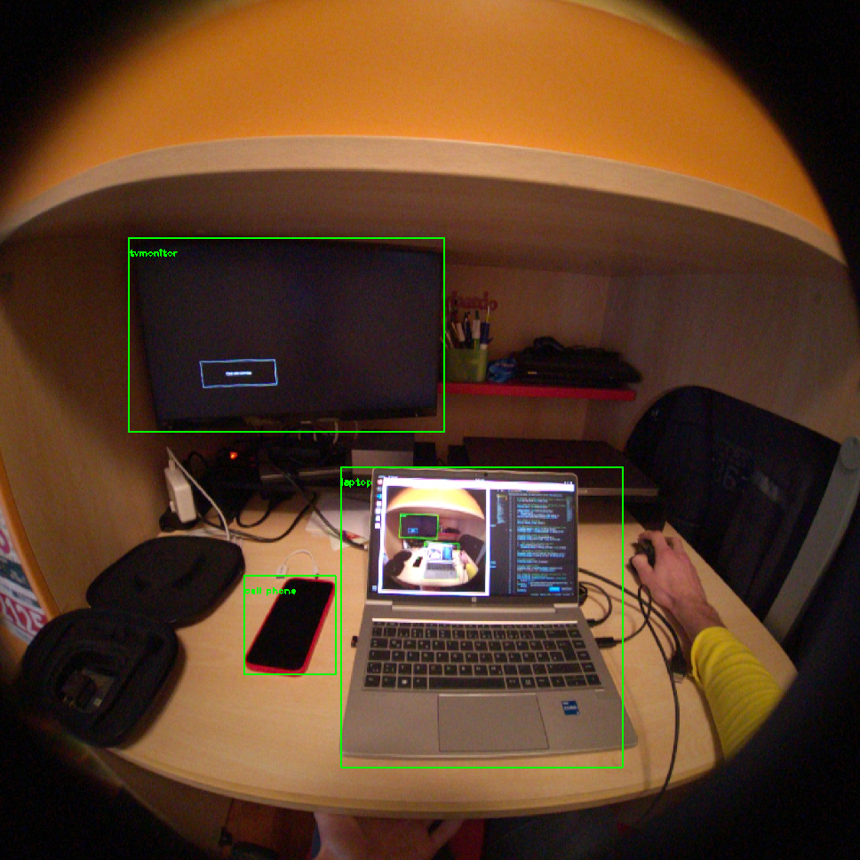

# Realtime Object Detection with Meta Aria Glasses and YOLO



## Description
This project enables real-time object detection using different versions of YOLO (You Only Look Once) in conjunction with the Meta Project Aria Glasses. It allows streaming video input via USB or WiFi and performs object detection on the streamed data. 

Available YOLO versions are:
- YOLOv3
- YOLOv4
- YOLOv7

## Prerequisites
- Python 3.x
- OpenCV (cv2)
- NumPy
- Aria SDK

For detailed requirements, refer to the official [Project Aria Tools documentation](https://facebookresearch.github.io/projectaria_tools/docs/ARK/sdk) and [OpenCV documentation](https://docs.opencv.org/4.x/)

## Usage
Run the script with the following commands, depending on your choice of interface (USB or WiFi) and specifying the YOLO configuration and weights:
- For USB interface and YOLOv3:
```bash
python realtimeYOLO.py --interface usb --yolo_weights yolov3-tiny.weights --yolo_cfg yolov3-tiny.cfg
```
- For WiFi interface and YOLOv3:
```bash
python realtimeYOLO.py --interface wifi --yolo_weights yolov3-tiny.weights --yolo_cfg yolov3-tiny.cfg --device_ip 10.7.129.82
```


